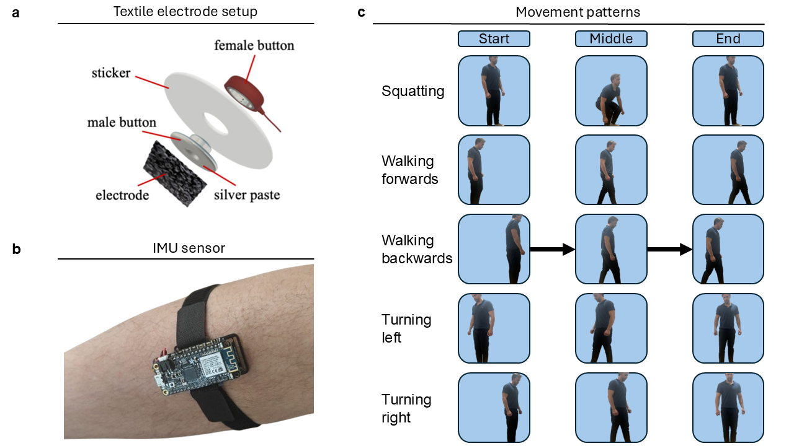

<div align="center">



# Exoskeleton: IMU/EMG Dataset Analysis and Motion Intention Modeling

Analysis and modeling of the public IMU + EMG dataset using ML models (CNN, LSTM, SVM) for lower-limb motion intention recognition.

[Dataset (DOI)](https://doi.org/10.17863/CAM.113504) • [Peer‑reviewed article](https://www.nature.com/articles/s41598-025-22103-1)

<br/>

<strong>Deep learning for motion classification in ankle exoskeletons using surface EMG and IMU signals</strong><br/>
Silas Ruhrberg Estévez, Josée Mallah, Dominika Kazieczko, Chenyu Tang & Luigi G. Occhipinti<br/>
Scientific Reports, 2025 • Volume 15 • Article number: 38242

</div>

## Overview

This repository contains:

- MATLAB scripts to preprocess the public dataset, train neural and classical models, and reproduce figures/analyses.
- Analysis utilities to generate confusion matrices, performance tables, and plots.

The dataset used in this work is publicly available via the University of Cambridge Apollo repository: https://doi.org/10.17863/CAM.113504. The full study is published in Nature Scientific Reports: https://www.nature.com/articles/s41598-025-22103-1.

> Note: This repository focuses solely on analysis of the provided dataset; firmware and live data-collection utilities are out of scope.

## Table of contents

- Quick start
- Repository structure
- Dataset
 Dataset: University of Cambridge Apollo Repository. DOI: https://doi.org/10.17863/CAM.113504
 Article: Deep learning for motion classification in ankle exoskeletons using surface EMG and IMU signals. Scientific Reports (2025), Volume 15, Article 38242. https://www.nature.com/articles/s41598-025-22103-1

 BibTeX:

 ```bibtex
 @article{RuhrbergEstevez2025,
	 title = {Deep learning for motion classification in ankle exoskeletons using surface EMG and IMU signals},
	 volume = {15},
	 ISSN = {2045-2322},
	 url = {http://dx.doi.org/10.1038/s41598-025-22103-1},
	 DOI = {10.1038/s41598-025-22103-1},
	 number = {1},
	 journal = {Scientific Reports},
	 publisher = {Springer Science and Business Media LLC},
	 author = {Ruhrberg Estévez, Silas and Mallah, Josée and Kazieczko, Dominika and Tang, Chenyu and Occhipinti, Luigi G.},
	 year = {2025},
	 month = oct
 }
 ```
 Maintainer: Silas Ruhrberg Estévez
- LSTM: run `src/c_run_lstm_model.m`
- SVM baseline: run `src/d_run_svm_baseline.m`
- Random baseline: run `src/e_random_baseline.m`

5) Reproduce analyses/plots
- Use scripts in `analysis/` to generate confusion matrices, performance tables, time-series figures, and channel ablation analyses.

## Repository structure

```
analysis/                  % Reproducible analysis and figure scripts (MATLAB)
	a_accuracy_cm.m
	b_confusion_matrix.m
	b_transfer_learning.m
	c_performance_table.m
	d_broken_channel_accuracy.m
	e_timeseries_classification.m
	f_processing_plot.m
	g_input_signals.m

src/                       % MATLAB modeling pipeline
	a_preprocess_data.m      % Point to raw data path; outputs processed features
	b_run_cnn_model.m        % Train/evaluate CNN
	c_run_lstm_model.m       % Train/evaluate LSTM
	d_run_svm_baseline.m     % SVM baseline
	e_random_baseline.m      % Random baseline sanity check
	exoskeleton_library.m    % Shared utility functions
	f_run_transfer_learning.m% Transfer learning experiments
	g_cnn_broken_channels.m  % CNN with channel ablation
	i_timeseries_classification.m % End-to-end time-series classification

README.md
```

## Dataset

- DOI: https://doi.org/10.17863/CAM.113504
- Please review the usage terms on the dataset page. Place the downloaded files under a folder such as `data/raw/`.
- In `src/a_preprocess_data.m`, set the input path to your local raw dataset directory. The script produces processed outputs under `data/processed/` (created if missing).

## MATLAB environment and prerequisites

Recommended toolboxes (depending on which scripts you run):

- Signal Processing Toolbox
- Statistics and Machine Learning Toolbox
- Deep Learning Toolbox

General notes:

- The scripts are standard MATLAB `.m` files and should run on recent MATLAB releases. If you encounter version-specific issues, please open an issue with your MATLAB version and error message.
- Some analyses may take longer on CPU; a GPU (with Deep Learning Toolbox support) will speed up CNN/LSTM training.

## Reproduce results (end-to-end)

1) Preprocess data
- Edit paths in `src/a_preprocess_data.m` to your dataset location.
- Run to generate train/validation/test splits and any derived features used downstream.

2) Train and evaluate models
- CNN: `src/b_run_cnn_model.m` produces training curves and evaluation metrics.
- LSTM: `src/c_run_lstm_model.m` for sequence modeling.
- SVM baseline: `src/d_run_svm_baseline.m` as a classical baseline.
- Random baseline: `src/e_random_baseline.m` sanity check.

3) Analyses and figures
- Confusion matrices and accuracy: `analysis/a_accuracy_cm.m`, `analysis/b_confusion_matrix.m`
- Transfer learning experiments: `analysis/b_transfer_learning.m`, `src/f_run_transfer_learning.m`
- Performance tables: `analysis/c_performance_table.m`
- Broken channel robustness: `analysis/d_broken_channel_accuracy.m`, `src/g_cnn_broken_channels.m`
- Time-series classification figures: `analysis/e_timeseries_classification.m`, `src/i_timeseries_classification.m`
- Processing and input signal plots: `analysis/f_processing_plot.m`, `analysis/g_input_signals.m`

Outputs are written to logical subfolders next to the scripts or into a results directory created by the scripts; check the printed paths in MATLAB’s Command Window.

## Scripts guide

- `src/a_preprocess_data.m`
	- Contract: reads raw dataset, outputs standardized/segmented representations and splits.
	- Edge cases: missing channels, variable sampling rates, empty trials. The script includes checks and will warn if inputs are incomplete.

- `src/b_run_cnn_model.m`
	- Convolutional model for motion intention classification. Accepts the preprocessed dataset; logs metrics and confusion matrices.

- `src/c_run_lstm_model.m`
	- Sequence model for temporal dependencies; good for longer windows.

- `src/d_run_svm_baseline.m`
	- Classical baseline using summary features or flattened windows.

- `src/f_run_transfer_learning.m`
	- Reuses pretrained representations; see comments in the file for the specific source/target configuration.

- `analysis/*`
	- Standalone figure and table generators. They assume model outputs exist; re-run after training to update figures.

## Results and figures

The `analysis/` scripts reproduce key tables and figures, including:

- Accuracy and confusion matrices by class
- Transfer learning performance
- Robustness to broken/missing channels
- Example time-series segments, processing and input signal visualizations

Figures are saved to disk by each script; see the script comments for output locations.

## Citation

If you use this repository, the dataset, or the results in your research, please cite:

- Dataset: University of Cambridge Apollo Repository. DOI: https://doi.org/10.17863/CAM.113504
- Article: Deep learning for motion classification in ankle exoskeletons using surface EMG and IMU signals. Scientific Reports (2025), Volume 15, Article 38242. https://www.nature.com/articles/s41598-025-22103-1


Ruhrberg Estévez, S., Mallah, J., Kazieczko, D. et al. Deep learning for motion classification in ankle exoskeletons using surface EMG and IMU signals. Sci Rep 15, 38242 (2025). https://doi.org/10.1038/s41598-025-22103-1

## License and acknowledgements

- License: MIT — see `LICENSE` in the repository root.
- Thanks to all contributors and participants involved in data collection and validation.

---

Maintainer: Silas Ruhrberg Estevez


